# ERD — CATÁLOGO, STOCK Y PRECIOS

> **PROPUESTA — no ejecutado.**

Dominio dimensionado sobre datos reales: **21.772 productos**, 25 marcas,
8 categorías, 0 SKUs duplicados, y sólo **378 productos con stock > 0**.

```mermaid
erDiagram
    companies ||--o{ products : "posee"
    brands ||--o{ products : "marca"
    product_categories ||--o{ products : "categoriza"
    product_categories ||--o{ product_categories : "padre"
    products ||--o{ product_components : "kit contiene"
    products ||--o{ product_equivalences : "equivale a"
    products ||--o{ product_files : "imágenes/fichas"
    files ||--o{ product_files : ""
    product_attribute_definitions ||--o{ products : "valida attributes"

    products ||--o{ stock_movements : "mueve"
    warehouses ||--o{ stock_movements : "en"
    products ||--o{ stock_balances : "saldo"
    warehouses ||--o{ stock_balances : ""
    products ||--o{ stock_reservations : "reserva"

    price_lists ||--o{ product_prices : "contiene"
    products ||--o{ product_prices : "precio de"
    currencies ||--o{ price_lists : "en"
    products ||--o{ product_costs : "costo de"
    suppliers ||--o{ product_costs : "provisto por"

    products {
        uuid id PK
        uuid company_id FK
        text sku UK "por empresa. 0 duplicados en el legacy"
        text name "100%"
        text model_code "legacy: base, 100%"
        uuid brand_id FK "75% - nullable: 5.456 sin marca"
        uuid category_id FK "100%"
        text product_type "42% - filtro principal"
        text series "42% - filtro principal"
        text description "100%"
        text description_long "99,7%"
        text origin_country "40% - ISO 3166"
        text ncm_code "24% - aduana"
        int weight_g "100%"
        int volume_cm3 "100%"
        jsonb attributes "cola larga validada"
        text status "active|discontinued|draft"
        boolean is_kit
        tsvector search_vector "GENERATED"
        text legacy_ref
        timestamptz created_at
        timestamptz deleted_at
    }

    brands {
        uuid id PK
        uuid company_id FK
        text name UK
        text logo_path
        boolean is_active
    }

    product_categories {
        uuid id PK
        uuid company_id FK
        uuid parent_id FK "jerarquía"
        text name
        text slug
        int position
    }

    product_attribute_definitions {
        uuid id PK
        uuid company_id FK
        text key UK "encastre, largo, rpm..."
        text label
        text data_type "text|number|boolean"
        text unit "mm, kg, Nm, rpm"
        uuid applies_to_category_id FK
        boolean is_filterable
    }

    product_components {
        uuid parent_product_id FK
        uuid component_product_id FK
        numeric quantity
    }

    product_equivalences {
        uuid id PK
        uuid product_id FK
        text competitor_brand "SPEEDRILL|TECNA|CP|IR"
        text competitor_sku
    }

    product_files {
        uuid product_id FK
        uuid file_id FK
        text role "image|datasheet|manual"
        int position
    }

    warehouses {
        uuid id PK
        uuid company_id FK
        text code UK
        text name
        boolean is_default
    }

    stock_movements {
        bigint id PK
        uuid company_id FK
        uuid product_id FK
        uuid warehouse_id FK
        text movement_type "purchase_receipt|sale_delivery|adjustment|transfer_in|transfer_out|return_in|return_out|opening_balance"
        numeric quantity "con signo"
        text source_type "delivery_note|purchase_receipt|manual"
        uuid source_id
        text notes
        uuid created_by FK
        timestamptz created_at
    }

    stock_balances {
        uuid product_id FK
        uuid warehouse_id FK
        numeric on_hand "por trigger"
        numeric reserved "por trigger"
        timestamptz updated_at
    }

    stock_reservations {
        uuid id PK
        uuid company_id FK
        uuid product_id FK
        uuid warehouse_id FK
        numeric quantity
        text source_type "sales_order"
        uuid source_id
        timestamptz expires_at
    }

    currencies {
        text code PK "ARS|USD|EUR"
        text symbol
        int decimals
    }

    price_lists {
        uuid id PK
        uuid company_id FK
        text name "Lista base|Distribuidor|..."
        text currency_code FK
        boolean is_default
        date valid_from
        date valid_to
    }

    product_prices {
        uuid id PK
        uuid price_list_id FK
        uuid product_id FK
        numeric amount
        date valid_from
        date valid_to
    }

    product_costs {
        uuid id PK
        uuid company_id FK
        uuid product_id FK
        uuid supplier_id FK
        numeric cost
        text currency_code FK
        date effective_date
    }
```



## Notas de diseño

### Columnas vs `attributes jsonb`

La línea se trazó con los porcentajes de llenado reales (sección F del
diseño), no por intuición. Suben a columna los campos que se **filtran**
(`product_type`, `series`) y los que consume otro módulo (`ncm_code`,
`origin_country` → Importación), aunque estén por debajo del 50%.

`product_attribute_definitions` es lo que impide que el JSONB se degrade:
toda clave usada tiene que estar declarada, con su tipo y su unidad. Es
además lo que permite construir la UI de filtros sin hardcodear nada.

### `stock_balances` no se escribe a mano

Sólo lo modifica el trigger sobre `stock_movements`. Un `UPDATE` directo
sería la puerta de entrada al problema del legacy (`stock = base + delta`,
con el delta en localStorage).

```
disponible = on_hand - reserved
proyectado = disponible + (recepciones de compra confirmadas y pendientes)
```

Reemplaza el par `sr`/`sv` del legacy, donde "virtual" mezcla reservado
con proyectado y nadie puede explicar el número.

### El costo vive aparte

`product_costs` es una tabla separada de `products` **por seguridad**: un
distribuidor con acceso al catálogo no debe ver el costo. Separada, eso es
una política RLS; dentro de `products`, dependería de que ningún `SELECT`
se olvide de excluir la columna.

### Lo que no se creó

`product_models` — 512 modelos distintos sobre 21.772 productos serían
casi una fila por producto. `model_code` queda como texto indexado. Si
más adelante hace falta agrupar variantes, la agrupación natural es
`brand_id + model_code`.
