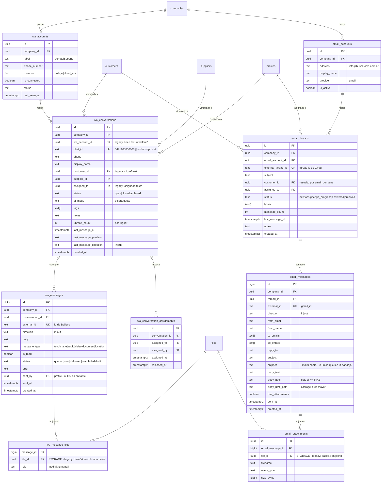

# ERD — COMUNICACIONES (WhatsApp y Email)

> **PROPUESTA — no ejecutado.**

Único dominio donde el legacy ya tiene tablas relacionales reales
(`suite_wa_*`, `erp_emails`). Se rediseñan por tres motivos: guardan media
en base64, referencian clientes y usuarios por texto, y asumen una sola
línea de WhatsApp.



## Notas de diseño

### Lo que cambia respecto del legacy

| Legacy | Nuevo | Por qué |
|---|---|---|
| `suite_wa_media.datos text` (**base64**) | `files` + Storage | Una foto de 2 MB ocupa ~2,7 MB en base64 **dentro de una fila**. Cualquier `SELECT *` la arrastra |
| `linea text DEFAULT 'default'` | `wa_account_id` FK | Habilita varios números sin tocar el schema |
| `cli_ref`, `cli_nombre`, `cli_tipo` | `customer_id` / `supplier_id` | FK real |
| `asignado text` (`'FACUNDO'`) | `assigned_to uuid` | FK a `profiles` |
| `erp_emails.attachments jsonb` (base64) | `email_attachments` + Storage | Idem |
| `erp_emails.body_html` completo | Columna sólo si ≤ 64 KB, si no a Storage | Un mail con firma e imágenes puede pesar cientos de KB |
| Política `FOR INSERT WITH CHECK (true)` | RLS real | **Hoy cualquiera puede insertar emails** |

### La bandeja nunca lee el cuerpo

```sql
SELECT id, subject, from_name, snippet, sent_at, status, assigned_to
FROM email_messages WHERE ...
```

Por eso `snippet` es una columna propia y no un `substring()` calculado:
el listado no debe tocar `body_text` ni `body_html`.

### Sanitización del HTML

El HTML se limpia **antes de guardarlo** (sin `<script>`, sin `<iframe>`,
sin handlers `on*`, sin `javascript:`), no al renderizarlo. Se limpia una
vez en vez de en cada apertura, y una fila envenenada no puede atacar a
otro cliente más adelante.

### Realtime

Este dominio es el único con Realtime, junto a notificaciones (ADR-006).
La suscripción a `wa_messages` actualiza el registro en la caché de
TanStack Query (`setQueryData`); **nunca** dispara un refetch completo,
que es lo que hace el legacy (`refrescar(false)` ante cualquier evento).

`unread_count` se mantiene por trigger sobre `wa_messages`, no
recalculando `COUNT(*)` en cada render.

### `wa_participants` no se creó

Hoy toda conversación es 1:1 con un teléfono. La tabla se agrega cuando
haya grupos de WhatsApp, sin romper nada: `wa_conversations` ya es la
entidad correcta para colgarla.
