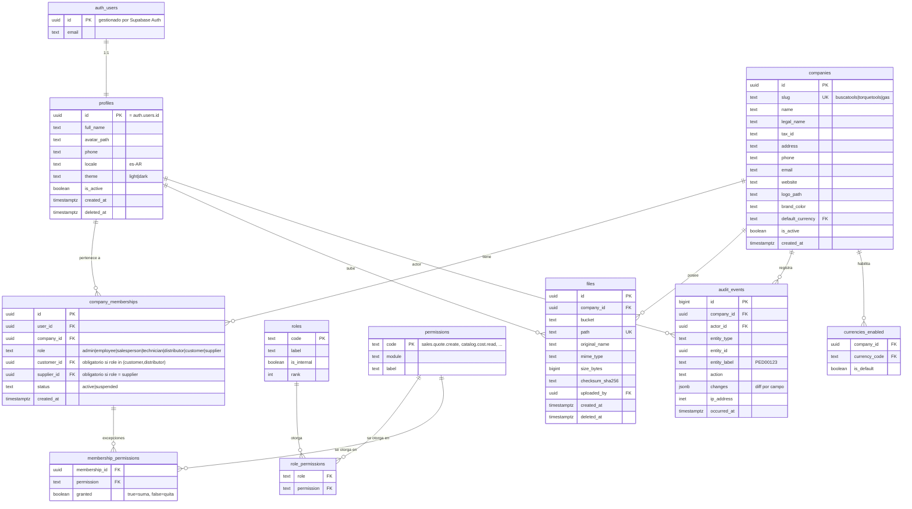

# ERD — CORE (identidad, empresas, permisos, archivos, auditoría)

> **PROPUESTA — no ejecutado.**

Es el dominio del que dependen todos los demás: define quién es quién, a
qué empresa pertenece y qué puede hacer.



## Notas de diseño

**`profiles.id = auth.users.id`.** Relación 1:1 con la tabla de Supabase
Auth, no una tabla de usuarios paralela. Las contraseñas nunca tocan el
schema `public`.

**`company_memberships` es el corazón del sistema.** La consulta

```sql
SELECT company_id FROM company_memberships
WHERE user_id = auth.uid() AND status = 'active'
```

se ejecuta —vía `app.current_company_ids()`— en **cada política RLS de
cada consulta**. De ahí que su índice sea el más importante de la base y
que la función se declare `STABLE` para que Postgres la evalúe una vez por
consulta y no una vez por fila.

**`customer_id` / `supplier_id` en la membresía** son lo que hace posible
"un cliente ve sólo sus pedidos". Un `CHECK` obliga a que estén presentes
para roles externos y ausentes para internos.

**`roles` y `permissions` son tablas, no `ENUM`s.** Agregar el rol
`supplier` cuando llegue el momento es un `INSERT`, no una migración de
tipo (ADR-011 / sección V).

**`files` no tiene `entity_type`/`entity_id`.** Los enlaces viven en
tablas por dominio (`product_files`, `maintenance_files`, …), por
integridad referencial. El razonamiento está en la sección O del diseño.

**`audit_events` usa `bigint`**: es append-only, de alto volumen y nunca
aparece en una URL.
