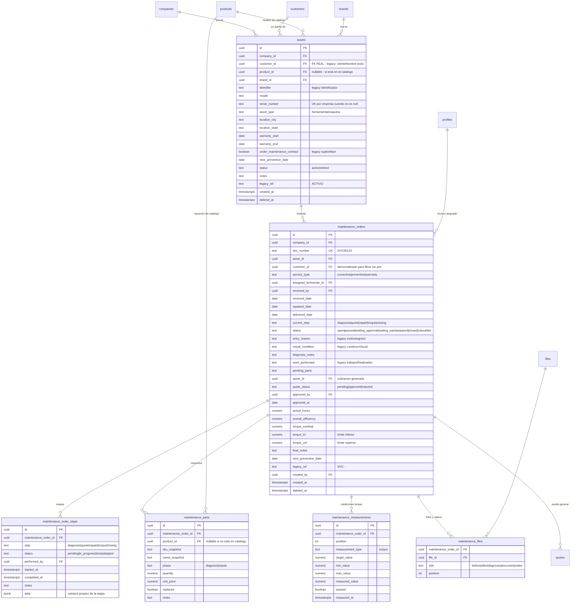

# ERD — MANTENIMIENTO

> **PROPUESTA — no ejecutado.**

La ficha del legacy (`mant_fichas`) tiene **36 campos en un solo objeto**
que mezclan cinco etapas del proceso. Acá se separa en cabecera + etapas +
tablas hijas.

## Notas de diseño

### Por qué se rompió la ficha de 36 campos

El objeto legacy mezcla estado actual, datos de cinco etapas y arrays de
tamaño fijo. Tres consecuencias concretas:

- **`torqueMediciones` es un array de 10 posiciones fijas**, siempre
  presente aunque se usen dos. Pasa a ser `maintenance_measurements`, con
  las filas que hagan falta.
- **`diagnosticoPartes {}` y `reparacionPartes {}`** son objetos sin forma
  definida. Pasan a ser `maintenance_parts` con una columna `phase`, y con
  FK al producto cuando el repuesto está en el catálogo — lo que permite
  descontar stock y calcular el costo real del servicio.
- **`lastStep` + `fechaIngreso/fechaReparacion/fechaEntrega/fechaAprobacion`**
  sólo dicen dónde está la ficha ahora. `maintenance_order_steps` guarda
  quién hizo cada etapa y cuándo, que es lo que se necesita para medir
  tiempos de taller.

`data jsonb` en cada etapa absorbe los campos específicos que hoy están
sueltos en la ficha (`aprietesIngreso`, `obsDiagnostico`, `obsCotizacion`…)
sin inflar la cabecera con columnas que sólo aplican a una etapa.

### Las preguntas que el modelo responde

| Pregunta | Consulta |
|---|---|
| ¿Qué equipos tiene el cliente? | `assets WHERE customer_id = $1` |
| ¿Cuándo se vendió? | `delivery_note_items` → `product_id` + serie |
| ¿Qué historial tiene la serie XYZ? | `assets.serial_number` → `maintenance_orders` |
| ¿Qué problema tuvo? | `entry_reason`, `diagnosis_notes` |
| ¿Qué técnico lo atendió? | `assigned_technician_id` |
| ¿Qué piezas se cambiaron? | `maintenance_parts WHERE replaced` |
| ¿Fotos y videos? | `maintenance_files` → `files` → Storage |
| ¿Está en garantía? | `warranty_end >= current_date` |
| ¿Próxima acción? | `next_preventive_date` |

### `asset_serials` no se creó

En los datos reales un activo **es** una unidad física con su número de
serie: `assets.serial_number`. Una tabla aparte sólo tendría sentido si un
activo agrupara varias unidades, y no hay evidencia de eso en el legacy.
Es un caso de sobre-normalización evitada.

### `technicians` tampoco

Un técnico es un `profile` con rol `technician` en su membresía. Una tabla
`technicians` duplicaría la identidad y obligaría a mantener dos altas por
persona.
