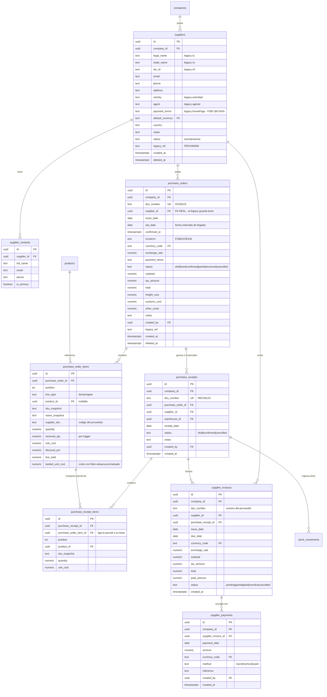

# ERD — COMPRAS E IMPORTACIÓN

> **PROPUESTA — no ejecutado.**

Simétrico a Ventas: mismas reglas de snapshot y de recepción parcial por
línea. Datos reales del legacy: **142 proveedores**.

## Notas de diseño

### Recepciones parciales

Igual que en ventas: `purchase_receipt_items.purchase_order_item_id` liga
cada recepción a la línea concreta que la origina, y `received_qty` se
mantiene por trigger. Nada de índices de array.

### Costos de importación

`freight_cost`, `customs_cost` y `other_costs` viven en la cabecera de la
orden, y `landed_unit_cost` en la línea guarda el costo real prorrateado
por unidad. Es lo que hoy calcula la "Calculadora Europa → Argentina" del
legacy (940 líneas) **sin persistir nada**: se calcula, se muestra y se
pierde.

Con el costo desembarcado guardado, el margen real por producto pasa a ser
una consulta en vez de un cálculo manual.

### Stock

Un `purchase_receipt` en estado `confirmed` genera movimientos
`purchase_receipt` en `stock_movements`. Es el único camino por el que
entra mercadería: no hay forma de sumar stock sin un documento que lo
respalde.

Las órdenes confirmadas y no recibidas alimentan el **stock proyectado**
(sección G del diseño), reemplazando el `sv` del legacy con un significado
verificable.

### Lo que no se creó todavía

Una tabla `imports` para el seguimiento de importaciones (despacho, BL,
aduana). El módulo existe en el legacy sólo como calculadora, sin
persistencia ni estados. Se diseña en Fase 5, cuando esté claro qué
estados sigue realmente el equipo; forzarlo ahora sería inventar campos
sin evidencia.
