# ERD — VENTAS Y CLIENTES

> **PROPUESTA — no ejecutado.**

Dominio donde se corrigen los dos peores defectos estructurales del
legacy: los documentos referencian al cliente **por texto**, y las
entregas parciales se rastrean **por índice de array**.

```mermaid
erDiagram
    companies ||--o{ customers : "posee"
    customers ||--o{ customer_contacts : "tiene"
    customers ||--o{ customer_addresses : "tiene"
    customers ||--o{ customer_sales_reps : "atendido por"
    profiles ||--o{ customer_sales_reps : "atiende"
    price_lists ||--o{ customers : "lista asignada"

    customers ||--o{ quotes : "recibe"
    quotes ||--o{ quote_items : "contiene"
    quotes ||--o{ sales_orders : "genera 1:N"
    customers ||--o{ sales_orders : "recibe"
    sales_orders ||--o{ sales_order_items : "contiene"
    quote_items ||--o{ sales_order_items : "origen"
    sales_orders ||--o{ delivery_notes : "genera 1:N parciales"
    delivery_notes ||--o{ delivery_note_items : "contiene"
    sales_order_items ||--o{ delivery_note_items : "entrega parcial de"
    delivery_notes ||--o{ sales_invoices : "genera"
    sales_invoices ||--o{ sales_invoice_items : "contiene"
    products ||--o{ quote_items : "referencia"
    products ||--o{ sales_order_items : "referencia"

    customers {
        uuid id PK
        uuid company_id FK
        text legal_name "legacy nj - hoy es la PK de facto"
        text trade_name "legacy nc - 97%"
        text tax_id "legacy cif - 60%"
        text[] email_domains "legacy doms - asocia mails entrantes"
        text phone
        text customer_type "business|individual"
        text payment_terms "30 DIAS F/F con ECHEQ"
        uuid default_price_list_id FK
        text default_currency FK
        numeric discount_pct
        numeric credit_limit
        text notes
        text status "active|inactive"
        text legacy_ref "CLI00719"
        timestamptz created_at
        timestamptz deleted_at
    }

    customer_contacts {
        uuid id PK
        uuid company_id FK
        uuid customer_id FK
        text full_name
        text role_title
        text email
        text phone
        boolean is_primary
    }

    customer_addresses {
        uuid id PK
        uuid customer_id FK
        text address_type "billing|shipping"
        text street
        text city
        text state
        text postal_code
        text country
        boolean is_default
    }

    customer_sales_reps {
        uuid customer_id FK
        uuid profile_id FK
        boolean is_primary
    }

    quotes {
        uuid id PK
        uuid company_id FK
        text doc_number UK "COT00123"
        uuid customer_id FK "FK REAL - el legacy guarda texto"
        uuid contact_id FK
        uuid salesperson_id FK
        date issue_date
        date valid_until
        text title
        text currency_code FK
        numeric exchange_rate
        text payment_terms
        numeric discount_pct "legacy dtoGlobal"
        numeric subtotal
        numeric tax_amount
        numeric total
        numeric total_units
        text status "draft|sent|accepted|rejected|expired|converted"
        text notes
        text customer_reference
        uuid created_by FK
        text legacy_ref
        timestamptz created_at
        timestamptz deleted_at
    }

    quote_items {
        uuid id PK
        uuid quote_id FK
        int position "orden ESTABLE"
        text line_type "item|chapter"
        uuid product_id FK "nullable ON DELETE SET NULL"
        text sku_snapshot
        text name_snapshot
        text description_snapshot
        numeric quantity
        numeric unit_price
        numeric discount_pct
        numeric tax_rate
        numeric line_total
    }

    sales_orders {
        uuid id PK
        uuid company_id FK
        text doc_number UK "PED00456"
        uuid quote_id FK "reemplaza fromCotizacion"
        uuid customer_id FK
        uuid salesperson_id FK
        date issue_date
        date promised_date
        text status "pending|partial|delivered|cancelled"
        numeric subtotal
        numeric tax_amount
        numeric total
        text cost_center
        uuid created_by FK
        timestamptz created_at
        timestamptz deleted_at
    }

    sales_order_items {
        uuid id PK
        uuid sales_order_id FK
        uuid quote_item_id FK
        int position
        text line_type
        uuid product_id FK
        text sku_snapshot
        text name_snapshot
        numeric quantity
        numeric delivered_qty "por trigger - reemplaza entregado[idx]"
        numeric unit_price
        numeric discount_pct
        numeric line_total
    }

    delivery_notes {
        uuid id PK
        uuid company_id FK
        text doc_number UK "NE00789"
        uuid sales_order_id FK
        uuid customer_id FK
        uuid shipping_address_id FK
        date issue_date
        text status "pending|delivered|invoiced|cancelled"
        numeric subtotal
        numeric total
        uuid created_by FK
        timestamptz created_at
    }

    delivery_note_items {
        uuid id PK
        uuid delivery_note_id FK
        uuid sales_order_item_id FK "CLAVE: liga la parcial a su linea"
        int position
        uuid product_id FK
        text sku_snapshot
        text name_snapshot
        numeric quantity
        numeric unit_price
        numeric line_total
    }

    sales_invoices {
        uuid id PK
        uuid company_id FK
        text doc_number UK
        uuid delivery_note_id FK
        uuid customer_id FK
        date issue_date
        date due_date
        date paid_date
        text status "pending|paid|overdue|cancelled"
        numeric subtotal
        numeric tax_amount
        numeric total
        timestamptz created_at
    }

    sales_invoice_items {
        uuid id PK
        uuid sales_invoice_id FK
        uuid delivery_note_item_id FK
        int position
        uuid product_id FK
        text sku_snapshot
        text name_snapshot
        numeric quantity
        numeric unit_price
        numeric line_total
    }
```



## Notas de diseño

### La cadena comercial

```
quote → sales_order → delivery_note → sales_invoice
```

Cada eslabón tiene FK directa al anterior. **Además**, cada línea apunta a
la línea que la origina. Eso es lo que hace confiables las entregas
parciales:

```sql
-- pendiente de entrega por línea — no depende de posiciones en un array
SELECT soi.id,
       soi.quantity - coalesce(sum(dni.quantity), 0) AS pendiente
FROM sales_order_items soi
LEFT JOIN delivery_note_items dni ON dni.sales_order_item_id = soi.id
WHERE soi.sales_order_id = $1
GROUP BY soi.id;
```

En el legacy esto es `ped.entregado[idx]`, indexado por la **posición** de
la línea en el array. Reordenar o borrar una línea reasigna silenciosamente
lo ya entregado a otro producto.

### Qué se congela en la línea

`sku_snapshot`, `name_snapshot`, `description_snapshot`, `unit_price`,
`discount_pct`, `tax_rate` quedan fijos al emitir: el documento impreso
debe poder reproducirse años después aunque el producto cambie de nombre,
de precio o desaparezca.

`product_id` se conserva **además**, con `ON DELETE SET NULL`, para poder
responder "cuánto vendimos de este producto". Si el producto se borra, la
línea sobrevive legible.

### `line_type = 'chapter'`

El legacy usa líneas `type:'chapter'` como separadores de sección dentro
de un presupuesto. Se conserva: es una funcionalidad real. Las líneas de
capítulo no tienen producto, cantidad ni precio, y quedan excluidas de
todos los cálculos por el `CHECK`.

### Vendedor por cliente y por documento

`customer_sales_reps` guarda la asignación estable (quién atiende a quién)
y `salesperson_id` en el documento guarda quién lo hizo realmente. Los dos
hacen falta: la política RLS del rol `salesperson` usa el primero para
listar su cartera y el segundo para sus documentos.
